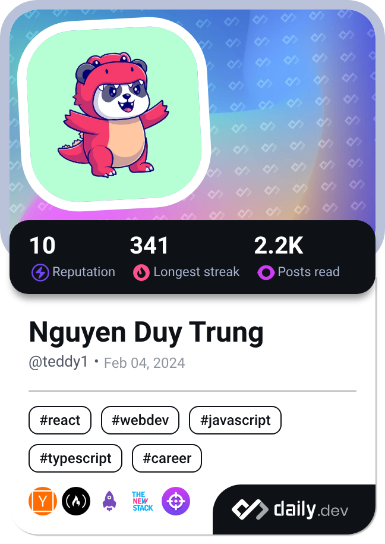

<h1 align='center'>
    
  </h1>

<h2 align='center'>Front End Developer </h2>

I am a last-year student at the University of Information Technology. I like to code things from scratch, and enjoy bringing ideas to life in the browser. My ability to work effectively in teams further complements my desire to excel in the field. I am excited to leverage these skills and contribute everything I have.

* 🌍  I'm based in Ho Chi Minh
* 🖥️  See my portfolio at [Portfolio](https://teddy.is-a.dev/)
* ✉️  You can contact me at [duytrung.ng1@gmail.com](mailto:duytrung.ng1@gmail.com)
* ⚡  I like playing sports and video games

### Socials

 <a href="https://www.facebook.com/iteddy17" target="_blank" rel="noreferrer"> <picture> <source media="(prefers-color-scheme: dark)" srcset="https://raw.githubusercontent.com/danielcranney/readme-generator/main/public/icons/socials/facebook-dark.svg" /> <source media="(prefers-color-scheme: light)" srcset="https://raw.githubusercontent.com/danielcranney/readme-generator/main/public/icons/socials/facebook.svg" />  </picture> </a> <a href="https://www.github.com/iTeddy1" target="_blank" rel="noreferrer"> <picture> <source media="(prefers-color-scheme: dark)" srcset="https://raw.githubusercontent.com/danielcranney/readme-generator/main/public/icons/socials/github-dark.svg" /> <source media="(prefers-color-scheme: light)" srcset="https://raw.githubusercontent.com/danielcranney/readme-generator/main/public/icons/socials/github.svg" />  </picture> </a> <a href="https://www.linkedin.com/in/duytrung-nguyen1" target="_blank" rel="noreferrer"> <picture> <source media="(prefers-color-scheme: dark)" srcset="https://raw.githubusercontent.com/danielcranney/readme-generator/main/public/icons/socials/linkedin-dark.svg" /> <source media="(prefers-color-scheme: light)" srcset="https://raw.githubusercontent.com/danielcranney/readme-generator/main/public/icons/socials/linkedin.svg" />  </picture> </a>

### Badges

<b>My GitHub Stats</b>

    

